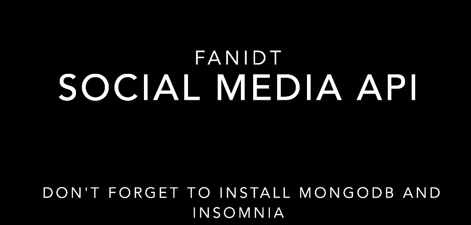

# SOCIAL-MEDIA-API

 ## Link to deployed application/Repository:  
  https://github.com/fanidt/socialmediaapi

 # Table of contents  
 -[Description](#Description)  
 -[User Story](#UserStory)  
 -[Badges](#Badges)  
 -[Screenshot](#Screenshot)  
 -[Installation](#Installation)  
 -[Usage](#Usage)  
 -[Support](#Support)  
 -[Contributions](#Contributions)  
 -[Authors](#Authors)  
 -[License](#Licence)  

  ## Description:  
  A Restful API for a social media application

  ## User Story:  
AS A social media startup  
I WANT an API for my social network that uses a NoSQL database  
SO THAT my website can handle large amounts of unstructured data
  
  ## Badges:  
  
  
  ## Screenshot:  
  (https://youtu.be/eLdCuvWI-b0)
  
  ## Installation:  
  -> download the file  
  -> open the file in the command line  
  -> type npm install   
  -> type npm start  

  ## Usage:  
  -> open insomnia   
  -> localhost:3001/...  
  -> Enjoy :)

  ## Support:  
  Contact us by email at: deltorofanie@gmail.com  
  Contact us at Github at: https://github.com/fanidt

  

  ## Contributions:  
  No contributions allowed

  ## Authors:  
  fanidt
  
  ## Licence:  
  MIT  
  License Link: https://opensource.org/licenses/MIT

